```mermaid
graph TD
    A[🐘 PHP/Laravel Master] --> B[🌐 Frontend Enhancement]
    B --> C[⚛️ React Fundamentals]
    C --> D[🔗 API Integration] 
    D --> E[🔷 C# Microservices]
    E --> F[🚀 Full-Stack Architect]
    
    A1[✅ MVC Architecture] --> A
    A2[✅ Eloquent ORM] --> A
    A3[✅ RESTful APIs] --> A
    
    B1[🔄 Modern JavaScript] --> B
    B2[🔄 CSS Frameworks] --> B
    B3[📋 Responsive Design] --> B
    
    C1[📚 Components] --> C
    C2[📚 State Management] --> C
    C3[📚 Hooks] --> C
    
    E1[📋 .NET Core] --> E
    E2[📋 Entity Framework] --> E
    E3[📋 Docker] --> E
```

<h1 align="center">
  
</h1>

 

 🇧🇷 I'm Brazilian |
🚀 **Full-Stack Developer** focused on **C# / .NET & React**  |
⚡ Experienced with **MySQL & SQLite** | 🔧 **WPF Desktop Development**  |
🎯 **Mission**: Build integrated solutions connecting **modern frontend** with **robust backend**
 

---

## <b> Tech Arsenal</b>

### **🖥️ C# / WPF & Database**
    

 

### **🌐 Frontend Stack**

 

### **🚀 Learning Path**

 

### **🛠️ Dev Tools**

 
🟣 Visual Studio Community

---

## <b> GitHub Analytics Dashboard </b>

<table>
<tr>
<td width="50%">

</td>
<td width="50%">

</td>
</tr>
</table>

---

##  <b>Achievement Showcase</b>

---

##  <b>Development Activity Graph</b>

---

##  <b>Code Contribution Snake</b>

<picture>
  <source media="(prefers-color-scheme: dark)" srcset="https://raw.githubusercontent.com/[JoandessonDev]/[JoandessonDev]/output/github-contribution-grid-snake-dark.svg">
  <source media="(prefers-color-scheme: light)" srcset="https://raw.githubusercontent.com/[JoandessonDev]/[JoandessonDev]/output/github-contribution-grid-snake.svg">
  
</picture>

---
<!--## <b>Featured Projects</b>

<table>
<tr>
<td width="50%">
<h3 align="center">🚀 C# / .NET E-Commerce</h3>

  

</td>
<td width="50%">
<h3 align="center">⚡ REST API Project</h3>

</td>
</tr>
<tr>
<td width="50%">
<h3 align="center">📱 React Learning Project</h3>

</td>
<td width="50%">
<h3 align="center">🔗 PHP + C# Integration</h3>

</td>
</tr>
</table>

-->

---

## 🎯 <b>Learning Roadmap</b>

---

## 🔥 <b>Current Focus Areas</b>

**🎯 2025 Development Goals**
- ⚛️ **React Component Architecture** - Reusable & maintainable components  
- 🔗 **API Integration Patterns** - C# .NET Core
- 📱 **Mobile-First Development** - Responsive React apps

## 📫 <b>Connect & Collaborate</b>

)

---

**💜 "Clean code always looks like it was written by someone who cares."**

*~ A C# and React developer evolving into Full-Stack mastery ~*

